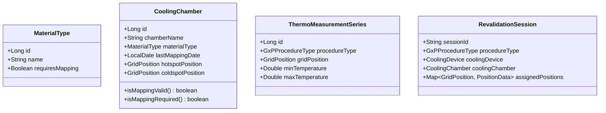

# Analiza Biznesowa: Mapowanie Komór Chłodniczych i Rewalidacja Okresowa GxP w RCKiK

## 1. Cel i Kontekst Biznesowy
W Regionalnych Centrach Krwiodawstwa i Krwiolecznictwa (RCKiK) komory chłodnicze służą do przechowywania krwi, jej składników oraz odczynników laboratoryjnych. Są to produkty o krytycznym znaczeniu dla zdrowia i życia ludzi, dlatego warunki ich przechowywania podlegają restrykcyjnemu rygorowi Dobrej Praktyki Dystrybucyjnej (DPD) oraz standardom GxP.

Aby zagwarantować stabilność temperatur w całej objętości urządzenia, każda komora chłodnicza musi przejść przez proces kwalifikacji temperaturowej. Proces ten opiera się na dwóch uzupełniających się procedurach:
1. **Mapowanie komory chłodniczej (Kwalifikacja 5-letnia)**
2. **Rewalidacja okresowa (Rewalidacja roczna)**

---

## 2. Mapowanie Komory Chłodniczej (5-letnie)
Mapowanie komory jest pełnym badaniem rozkładu temperatur wykonywanym za pomocą siatki 8 sensorów (rozmieszczonych w 8 narożnikach komory zgodnie z normą DIN 12880 oraz wytycznymi PDA Technical Report No. 64). 

### 2.1. Punkty Krytyczne (Hotspot / Coldspot)
Głównym celem biznesowym mapowania jest identyfikacja fizycznych lokalizacji punktów o ekstremalnych temperaturach wewnątrz komory:
*   **Hotspot (Punkt najcieplejszy)** – pozycja siatki geometrycznej, w której odnotowano najwyższą temperaturę w trakcie całego okresu pomiarowego.
*   **Coldspot (Punkt najzimniejszy)** – pozycja siatki geometrycznej, w której odnotowano najniższą temperaturę w trakcie całego okresu pomiarowego.

Lokalizacje te są zapisywane w ewidencji komory chłodniczej i stanowią podstawę do monitorowania urządzenia w kolejnych latach.

### 2.2. Reguły Walidacyjne Mapowania (Kryteria Odrzucenia)
Pomiar temperatury w celach mapowania charakteryzuje się wysokimi wymaganiami dokładności. Z uwagi na bezpieczeństwo przechowywanych materiałów, mapowanie uznaje się za **nieudane (błędne)** i wymagające powtórzenia w następujących przypadkach:
1.  **Niejednoznaczność Hotspotu**: Więcej niż jeden punkt pomiarowy (narożnik) osiągnął tę samą maksymalną odnotowaną temperaturę globalną (np. dwie różne pozycje odnotowały $5.8^\circ\text{C}$).
2.  **Niejednoznaczność Coldspotu**: Więcej niż jeden punkt pomiarowy (narożnik) osiągnął tę samą minimalną odnotowaną temperaturę globalną (np. dwie różne pozycje odnotowały $3.2^\circ\text{C}$).
3.  **Kolizja Punktów Skrajnych (Nałożenie)**: Zidentyfikowany Hotspot oraz Coldspot znajdują się na tej samej pozycji geometrycznej (ten sam narożnik okazał się jednocześnie najzimniejszy i najcieplejszy, co wskazuje na wadliwy przebieg pomiaru lub skrajną niestabilność komory).

> [!WARNING]
> W przypadku wystąpienia któregokolwiek z powyższych warunków, system VCC **blokuje możliwość zatwierdzenia i zapisania wyników mapowania**. Użytkownik musi powtórzyć procedurę pomiarową.

---

## 3. Zależność Mapowania od Rodzaju Przechowywanego Materiału
Obowiązek przeprowadzenia mapowania 5-letniego zależy bezpośrednio od przeznaczenia komory chłodniczej, a dokładnie od rodzaju przechowywanego w niej materiału (`MaterialType`):
*   **Wymagane Mapowanie GxP (`requiresMapping = true`)**: Dotyczy komór wykorzystywanych do przechowywania materiałów o najwyższym stopniu krytyczności, takich jak **składniki krwi** (np. KPN, KKCz, osocze).
*   **Niewymagane Mapowanie GxP (`requiresMapping = false`)**: Dotyczy komór przechowujących materiały pomocnicze lub badawcze, takie jak **odczynniki** (reagents) lub **próby do badań** (test samples). Dla takich komór proces mapowania jest opcjonalny.

Wymóg ten jest definiowany na poziomie słownika typów materiałów (`MaterialType`) za pomocą flagi `Wymaga mapowania GxP`. System automatycznie sprawdza tę flagę, aby określić reguły walidacyjne podczas uruchamiania procedury rewalidacji okresowej.

---

## 4. Cykl Życia i Ważność Mapowania
*   Mapowanie komory chłodniczej ważne jest przez **5 lat** (dokładnie 1825 dni) od daty jego pomyślnego zakończenia.
*   Po upływie 5 lat, mapowanie traci ważność (wygasa), co w przypadku materiałów wymagających mapowania wymusza przeprowadzenie pełnego mapowania 8-kanałowego od nowa.
*   Dla komór chłodniczych z materiałem wymagającym mapowania, aktualne i ważne mapowanie jest **warunkiem koniecznym** do przeprowadzenia rewalidacji okresowej.

---

## 5. Rewalidacja Okresowa (Rewalidacja Roczna)
W okresie pomiędzy pełnymi mapowaniami (lata 1-4) wykonywana jest coroczna, uproszczona procedura rewalidacji okresowej. 

### 5.1. Wymuszenie Rozmieszczenia Rejestratorów w Punktach Krytycznych
Biznesowy rygor rewalidacji okresowej zależy od flagi `requiresMapping` przypisanego typu materiału komory:

1.  **Gdy materiał wymaga mapowania (`requiresMapping = true`)**:
    *   Rewalidacja okresowa wymaga użycia **przynajmniej dwóch rejestratorów**.
    *   **Wymóg krytyczny**: Użytkownik musi bezwzględnie umieścić rejestratory i wgrać dane pomiarowe dla pozycji zadeklarowanych jako **Hotspot** oraz **Coldspot** w ostatnim ważnym mapowaniu.
    *   Jeśli użytkownik spróbuje zatwierdzić rewalidację okresową bez przypisania sensorów do tych dwóch punktów skrajnych lub jeśli komora nie posiada ważnego mapowania 5-letniego, system zgłasza **błąd GxP (blokadę)** i uniemożliwia zapisanie sesji.
2.  **Gdy materiał NIE wymaga mapowania (`requiresMapping = false`)**:
    *   Rewalidacja okresowa może być przeprowadzona bez ważnego mapowania 5-letniego.
    *   System nie wymusza wgrania danych dla określonych punktów skrajnych (Hotspot/Coldspot), umożliwiając dowolne rozmieszczenie rejestratorów (na podstawie standardowej konfiguracji operatora).

---

## 6. Zgodność z GxP i Regulacjami (FDA 21 CFR Part 11 / GMP Annex 11)
Wszystkie dane dotyczące punktów krytycznych komory chłodniczej oraz daty wykonania mapowań są danymi krytycznymi metrologicznie:
*   **Audit Trail (Śledzenie zmian)**: Każdy zapis nowego mapowania, modyfikacja właściwości komory chłodniczej (hotspot, coldspot, data) oraz zmiana flagi wymagania mapowania w `MaterialType` muszą być automatycznie rejestrowane w bazie danych audytowych za pomocą mechanizmu Hibernate Envers.
*   **Nienaruszalność Raportów**: Skompilowany raport z mapowania oraz rewalidacji okresowej w pliku PDF musi zawierać jawny rodzaj procedury, informacje o materiale, wyszczególnione punkty krytyczne (jeśli dotyczy) oraz sumę kontrolną SHA-256 potwierdzającą integralność danych pomiarowych.
*   **Inteligentna Blokada "Hard-Lock"**: W przypadku wygaśnięcia mapowania lub jego braku dla komory z materiałem krytycznym, system blokuje przejście do rewalidacji rocznej. Jeśli materiał nie wymaga mapowania, system pozwala na rewalidację bez ostrzeżeń blokujących.

## 7. Dokumentacja Techniczna Wdrożenia

### 7.1. Model Domenowy (Mermaid Class Diagram)


#### 1a. Zmiany w `MaterialType.java`
Dodanie flagi określającej wymóg mapowania:
```java
    @Column(name = "requires_mapping", nullable = false)
    @Builder.Default
    private Boolean requiresMapping = false;
```

#### 2. [GxPProcedureService.java](file:///c:/Users/macie/Desktop/VCC%20Desktop%20APP/validation-desktop/src/main/java/com/mac/bry/desktop/service/GxPProcedureService.java)
- Aktualizacja metody `loadProcedures()`:
  Zamiast wnioskować o typie procedury po liczbie wgranych sensorów, system odczytuje pole `procedureType` z bazy danych z pierwszej serii w grupie:
  ```java
  GxPProcedureType pType = representative.getProcedureType();
  String typeName = (pType == GxPProcedureType.MAPPING) 
          ? "Mapowanie Komory (Kwalifikacja 5-letnia)" 
          : "Rewalidacja Okresowa Komory (Kwalifikacja Roczna)";
  ```

#### 3. [AuditService.java](file:///c:/Users/macie/Desktop/VCC%20Desktop%20APP/validation-desktop/src/main/java/com/mac/bry/desktop/security/service/AuditService.java)
- Rozszerzenie metody `compareMaterialTypeFields` w celu rejestrowania zmian we właściwości `requiresMapping`:
  ```java
  if (!java.util.Objects.equals(oldM.getRequiresMapping(), newM.getRequiresMapping())) {
      addEntry(history, revId, ts, modBy, "Wymaga mapowania", String.valueOf(oldM.getRequiresMapping()), String.valueOf(newM.getRequiresMapping()));
  }
  ```

### 7.2. Skrypt Migracyjny SQL
```sql
-- V22: Add cooling chamber mapping columns, procedure type, and material mapping requirement
-- Author: macie - Deepmind coding agent

-- 1. Modyfikacja tabeli operacyjnej komór chłodniczych
ALTER TABLE cooling_chambers
    ADD COLUMN last_mapping_date DATE NULL,
    ADD COLUMN hotspot_position VARCHAR(50) NULL,
    ADD COLUMN coldspot_position VARCHAR(50) NULL;

-- 2. Modyfikacja tabeli audytowej komór chłodniczych (Envers)
ALTER TABLE cooling_chambers_aud
    ADD COLUMN last_mapping_date DATE NULL,
    ADD COLUMN hotspot_position VARCHAR(50) NULL,
    ADD COLUMN coldspot_position VARCHAR(50) NULL;

-- 3. Dodanie typu procedury do serii pomiarowych
ALTER TABLE thermo_measurement_series
    ADD COLUMN procedure_type VARCHAR(50) NOT NULL DEFAULT 'PERIODIC_REVALIDATION';

ALTER TABLE thermo_measurement_series_aud
    ADD COLUMN procedure_type VARCHAR(50) NULL;

-- 4. Dodanie flagi wymagań mapowania do słownika materiałów
ALTER TABLE material_types
    ADD COLUMN requires_mapping BOOLEAN NOT NULL DEFAULT FALSE;

ALTER TABLE material_types_aud
    ADD COLUMN requires_mapping BOOLEAN DEFAULT FALSE;

-- 5. Inicjalne ustawienie flagi dla składników krwi
UPDATE material_types SET requires_mapping = TRUE WHERE name LIKE '%krew%' OR name LIKE '%osocze%' OR name LIKE '%KKCz%' OR name LIKE '%KPN%';
```
