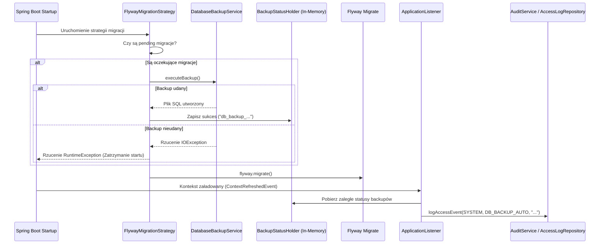

# Plan Implementacji - System Kopii Zapasowych i Bezpiecznych Migracji Bazy Danych

## 1. Cel i zakres zmian
Celem technicznym jest integracja istniejącego serwisu `DatabaseBackupService` z procesem migracji Flyway (przed migracją) oraz udostępnienie panelu zarządzania kopiami zapasowymi w Panelu Administratora aplikacji desktopowej.

Zakres prac obejmuje:
1.  **Integracja Flyway + Backup (Safe-Fail Startup):** Blokowanie migracji i startu aplikacji, jeśli backup przed migracją się nie powiedzie.
2.  **Rozszerzenie `DatabaseBackupService.java`:** Dodanie pobierania listy backupów (DTO) oraz wsparcie dla ręcznego wyzwalania kopii.
3.  **Integracja z Audit Trail:** Logowanie zdarzeń automatycznych i ręcznych kopii.
4.  **Budowa UI w Panelu Administratora:** Nowa zakładka "Kopie Zapasowe" dostępna dla roli `ROLE_SUPER_ADMIN`.

---

## 2. Architektura i Szczegóły Techniczne

### 2.1. Zabezpieczenie przed Premature Initialization (JPA Circular Dependency)
Ponieważ migracje Flyway odbywają się na samym początku startu kontekstu Spring Boot (zanim zostanie w pełni zainicjalizowany Hibernate i `EntityManager` / `JpaRepository`), wywołanie `AuditService` (które zależy od JPA) bezpośrednio wewnątrz `FlywayMigrationStrategy` spowodowałoby błędy kołowej zależności lub błędy wczesnej inicjalizacji. 

**Rozwiązanie:**
Użyjemy mechanizmu tymczasowego bufora stanu w pamięci (`BackupStatusHolder`) do zebrania informacji o wykonanym backupie przed migracją. Następnie, po pełnym załadowaniu kontekstu, nasłuchiwacz zdarzeń Spring (`EventListener` na `ContextRefreshedEvent`) zapisze te zdarzenia do bazy danych za pomocą `AuditService`.

---

## 3. Szczegółowy wykaz zmian w plikach

### 3.1. Klasa pomocnicza stanu: `BackupStatusHolder.java`
*   **Klasa:** `com.mac.bry.desktop.config.BackupStatusHolder` [NEW]
*   Przechowuje statyczną listę zdarzeń backupów wykonanych podczas rozruchu aplikacji przed pełną gotowością JPA.

### 3.2. Konfiguracja Flyway: `FlywayConfig.java`
*   **Modyfikacja:** [MODIFY] `c:\Users\macie\Desktop\VCC Desktop APP\validation-desktop\src\main\java\com\mac\bry\desktop\config\FlywayConfig.java`
*   Wstrzyknięcie `DatabaseBackupService` oraz wstrzyknięcie parametru konfiguracji `@Value("${app.backup.fail-on-backup-error:true}") boolean failOnBackupError`.
*   Przed wywołaniem `flyway.migrate()`, wywołanie sprawdzenia: `flyway.info().pending()`. Jeśli długość tablicy > 0, wywołanie `backupService.executeBackup()`. 
*   **Obsługa błędu backupu:** 
    *   Jeśli `failOnBackupError` to `true` (tryb GxP) -> rzucamy wyjątek przerywający start aplikacji.
    *   Jeśli `failOnBackupError` to `false` -> logujemy błąd jako ostrzeżenie (`log.warn`) i pozwalamy na migrację oraz start.

### 3.3. Serwis kopii zapasowych: `DatabaseBackupService.java`
*   **Modyfikacja:** [MODIFY] `c:\Users\macie\Desktop\VCC Desktop APP\validation-desktop\src\main\java\com\mac\bry\desktop\service\DatabaseBackupService.java`
*   Dodanie klasy DTO: `BackupFileDto` (pole nazwa pliku, data utworzenia, rozmiar w MB/KB).
*   Dodanie metody `public List<BackupFileDto> getAvailableBackups()` - skanuje katalog `app.backup.directory`, wyciąga informacje o plikach `.sql` i sortuje je od najnowszego.
*   Dodanie metody `public File executeBackupAndReturnFile() throws IOException, InterruptedException` - identyczna z obecną `executeBackup`, ale zwracająca referencję do nowo utworzonego pliku (do celów prezentacji w UI i audytu).

### 3.4. Dziennik Zdarzeń (Audit Event Listener)
*   **Klasa:** `com.mac.bry.desktop.security.listener.BackupAuditEventListener` [NEW]
*   Klasa z adnotacją `@Component`, implementująca nasłuchiwacz `@EventListener(ContextRefreshedEvent.class)`. Zapisuje zaległe informacje o automatycznym backupie z `BackupStatusHolder` do bazy danych za pomocą `AuditService`.

### 3.5. Widok i Kontroler UI Panelu Administratora
*   **Widok FXML:** `admin_backup.fxml` [NEW] w `src/main/resources/ui/`
    *   Tabela (`TableView`) pokazująca dostępne backupy (Nazwa pliku, Data modyfikacji, Rozmiar).
    *   Przycisk `Stwórz Kopię Zapasową` (`btnCreateBackup`) z małym animowanym `ProgressIndicator`.
    *   Tekstowa sekcja instruktażu odtwarzania bazy (GxP - instrukcja Disaster Recovery).
*   **Kontroler Java:** `AdminBackupController.java` [NEW] w `com.mac.bry.desktop.controller`
    *   Metoda `initialize()` - asynchronicznie ładuje listę plików z serwisu do tabeli.
    *   Metoda `handleCreateBackup()` - uruchamia `Task<File>` w tle, aby zapobiec blokowaniu wątku UI JavaFX.
    *   W przypadku sukcesu: dodaje nowy log audytowy `DB_BACKUP_MANUAL`, odświeża listę, wyświetla alert sukcesu.
    *   W przypadku błędu: wyświetla okno dialogowe z komunikatem błędu.
*   **Modyfikacja Panelu Głównego:** [MODIFY] `admin_panel.fxml` oraz `AdminPanelController.java`
    *   Dodanie zakładki "Kopie Zapasowe" z włączeniem `admin_backup.fxml`.
    *   Zabezpieczenie przed dostępem osób bez `ROLE_SUPER_ADMIN` (analogicznie do zakładki Struktura).

---

## 4. Plan Weryfikacji (Testy i Walidacja)

### 4.1. Scenariusze Testów Automatycznych (Unit/Integration Tests)
*   **TST-BKP-01: Weryfikacja pomijania backupu:** Test integracyjny sprawdzający, czy przy braku oczekujących migracji Flyway, `DatabaseBackupService` nie jest wywoływany i start aplikacji przebiega pomyślnie.
*   **TST-BKP-02: Weryfikacja udanego backupu i migracji:** Test z atrapą migracji (np. migracja testowa H2/MySQL). Sprawdzenie, czy przed migracją tworzy się plik backupu i zapisuje się w strukturze.
*   **TST-BKP-03: Blokada przy awarii backupu:** Test integracyjny symulujący błąd I/O (np. błędna ścieżka do `mysqldump` lub brak uprawnień zapisu). Test powinien potwierdzić, że aplikacja przerywa start, rzucając wyjątek i nie uruchamia migracji.

### 4.2. Weryfikacja Manualna (OQ - Operational Qualification)
1.  **Test startu z nową migracją:**
    *   Wrzuć ręcznie nowy, pusty plik migracji (np. `V24__Test_backup_migration.sql`) do `db/migration`.
    *   Uruchom aplikację.
    *   Sprawdź w folderze `backups/db`, czy powstał plik backupu o nazwie zawierającej datę sprzed startu migracji.
    *   Sprawdź w logach, czy pojawił się wpis o wykonaniu automatycznego backupu.
    *   Zaloguj się jako Super Admin i sprawdź w zakładce "Logi Dostępu", czy zapisano zdarzenie `DB_BACKUP_AUTO` o treści: "Automatyczny backup przed migracją".
2.  **Test awarii (brak mysqldump):**
    *   W pliku konfiguracyjnym zmień tymczasowo ścieżkę `app.backup.mysql-dump-path` na nieistniejący plik (np. `mysqldump_error`).
    *   Uruchom aplikację z oczekującą migracją.
    *   Zweryfikuj, że aplikacja nie uruchomiła się, a w logach konsoli widnieje błąd informujący o nieudanym backupie przed migracją.
3.  **Test UI Panelu Administratora:**
    *   Zaloguj się jako użytkownik z uprawnieniami `ROLE_SUPER_ADMIN`.
    *   Wejdź do Panelu Administratora -> zakładka "Kopie Zapasowe".
    *   Sprawdź, czy lista zawiera wcześniej utworzone pliki backupów.
    *   Kliknij "Stwórz Kopię Zapasową". Zweryfikuj, czy pojawia się loader, po czym lista odświeża się, a w tabeli pojawia się nowy plik.
    *   Sprawdź, czy po wylogowaniu i zalogowaniu jako zwykły użytkownik/audytor, zakładka ta nie jest dostępna.
