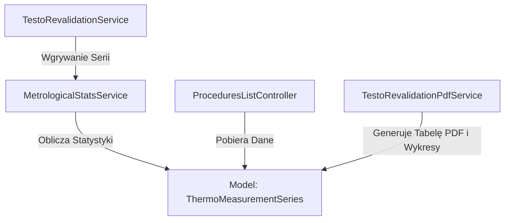

# Analiza Biznesowa (BA) i Specyfikacja Techniczna: Moduł Statystyk Metrologicznych GxP dla Serii Pomiarowych

## 1. Wprowadzenie i Cel Biznesowy

W farmaceutycznych systemach zapewnienia jakości (GxP, GMP, FDA 21 CFR Part 11) oraz w laboratoriach akredytowanych (ISO/IEC 17025) sama rejestracja temperatur jest niewystarczająca do walidacji komór chłodniczych. Kluczowym elementem jest zaawansowana analiza statystyczna i metrologiczna serii pomiarowych, która dostarcza dowodów na stabilność, jednorodność i bezpieczeństwo przechowywanych materiałów (szczepionek, leków, próbek biologicznych).

Celem niniejszego modułu jest przeniesienie zaimplementowanego w pierwotnej aplikacji webowej (Spring Boot) silnika obliczeniowego na grunt aplikacji desktopowej JavaFX w celu automatycznego wyliczania zaawansowanych statystyk dla każdej wczytanej serii pomiarowej.

---

## 2. Analiza Biznesowa (BA) — Wymagane Metryki i Wzory Matematyczne

Aplikacja będzie wyliczać i wizualizować 6 głównych grup wskaźników metrologicznych dla każdej serii pomiarowej (reprezentującej jeden narożnik siatki pomiarowej):

### A. Statystyki Opisowe i Rozkładu
1. **Temperatura Minimalna ($T_{min}$)** oraz **Maksymalna ($T_{max}$)** [°C]: Wyznaczenie wartości skrajnych serii.
2. **Temperatura Średnia ($T_{avg}$)** [°C]:
   $$T_{avg} = \frac{1}{n} \sum_{i=1}^{n} T_i$$
3. **Mediana Temperatury ($T_{med}$)** [°C]: Wartość środkowa posortowanej serii pomiarowej.
4. **Wariancja ($\sigma^2$)** oraz **Odchylenie Standardowe ($\sigma$)** [°C]: Miara rozrzutu temperatur wokół średniej.
   $$\sigma^2 = \frac{1}{n} \sum_{i=1}^{n} (T_i - T_{avg})^2 \quad , \quad \sigma = \sqrt{\sigma^2}$$
5. **Współczynnik Zmienności ($CV\%$)**: Miara względnego rozproszenia temperatury.
   $$CV\% = \left( \frac{\sigma}{|T_{avg}|} \right) \cdot 100\%$$
6. **Percentyle P5 oraz P95** [°C]: Wyznaczane metodą interpolacji liniowej rankingu. Wyznaczają zakres, w którym mieści się 90% wszystkich odczytów, eliminując skrajne zakłócenia losowe.

### B. Średnia Temperatura Kinetyczna (MKT — Mean Kinetic Temperature)
MKT to jedna z najważniejszych metryk w farmacji. Reprezentuje stałą temperaturę, która wywiera taki sam wpływ na degradację substancji czynnej, jak rzeczywiste, zmienne w czasie temperatury. Opiera się na równaniu Arrheniusa.

$$MKT = \frac{\frac{\Delta H}{R}}{-\ln\left(\frac{e^{-\frac{\Delta H}{R \cdot T_{K,1}}} + e^{-\frac{\Delta H}{R \cdot T_{K,2}}} + \dots + e^{-\frac{\Delta H}{R \cdot T_{K,n}}}}{n}\right)} - 273.15$$

Gdzie:
* $R = 8.314472 \text{ J/(mol}\cdot\text{K)}$ — uniwersalna stała gazowa.
* $\Delta H$ — energia aktywacji. Domyślna wartość w farmacji (zgodnie z USP <1150>) to **$83.14 \text{ kJ/mol}$** (czyli $83140 \text{ J/mol}$), co upraszcza stosunek $\frac{\Delta H}{R}$ do stałej **$10000 \text{ K}$**. Jeżeli do komory przypisano specyficzny typ materiału (`MaterialType`), energia aktywacji pobierana jest bezpośrednio z jego właściwości.
* $T_{K,i}$ — temperatura $i$-tego punktu pomiarowego wyrażona w **Kelwinach** ($T_i + 273.15$).

### C. Statystyki Czasowe Przekroczeń i Naruszeń Limitów
Analiza czasu, w którym urządzenie przebywało poza dopuszczalnym zakresem operacyjnym $[T_{limit,min}, T_{limit,max}]$ komory:
1. **Czas w zakresie (Time in Range)** [minuty]: Łączny zsumowany interwał pomiarowy, w którym temperatura była poprawna.
2. **Czas poza zakresem (Time Out of Range)** [minuty]: Zsumowany interwał pomiarowy temperatur niepoprawnych.
3. **Liczba incydentów (Violation Count)**: Liczba rozpoczętych okresów przebywania poza zakresem.
4. **Maksymalny ciągły czas naruszenia (Max Violation Duration)** [minuty]: Najdłuższy nieprzerwany czas, w którym temperatura przekraczała limit.

### D. Analiza Trendu (Regresja Liniowa)
Wyznaczenie współczynnika trendu (nachylenia linii regresji) $b$ wyrażonego w [°C/godzinę], określającego powolne dryftowanie układu chłodzenia:
$$b = \frac{n \sum (t_i \cdot T_i) - \sum t_i \sum T_i}{n \sum t_i^2 - (\sum t_i)^2}$$
Gdzie:
* $t_i$ — czas w godzinach, który upłynął od momentu rozpoczęcia serii pomiarowej ($t_1 = 0$).
* $T_i$ — temperatura $i$-tego punktu pomiarowego.
* **Dobowy współczynnik dryftu** ($Dryft_{24h}$) = $b \cdot 24.0$ [°C/24h].

### E. Zaawansowana Diagnostyka "Drift vs Spike" (Metoda A+)
W laboratoriach metrologicznych kluczowe jest odróżnienie powolnego zużywania się agregatu chłodniczego (**dryft**) od nagłych, krótkotrwałych zdarzeń przejściowych, takich jak otwarcie drzwi komory lub odszranianie (**szpilka / spike**). 

Algorytm **Metody A+** realizowany jest w następujących krokach:
1. **Obliczenie residuali (odchyleń):** Wyznaczenie odległości każdego punktu pomiarowego od wyliczonej linii trendu:
   $$R_i = T_i - (a + b \cdot t_i)$$
2. **Obliczenie wskaźnika MAD (Median Absolute Deviation):** Solidna statystycznie miara rozproszenia szumów pomiarowych, odporna na wartości skrajne (szpilki):
   $$MAD = \text{median}(|R_i - \text{median}(R)|)$$
3. **Wykrywanie szpilek:** Punkty pomiarowe, których bezwzględne odchylenie residualne przekracza próg czułości:
   $$|R_i - \text{median}(R)| > 3.5 \cdot MAD$$
4. **Event Padding ($\pm 1$):** W celu eliminacji efektu histerezy, indeksy szpilek są rozszerzane o bezpośrednich sąsiadów ($idx - 1, idx, idx + 1$).
5. **Regresja skorygowana:** Wykluczenie punktów oznaczonych jako szpilki i ponowne dopasowanie linii regresji liniowej w celu wyliczenia rzeczywistego dryftu urządzenia ($b_{adj}$).
6. **Klasyfikacja serii:**
   * **`STABLE`**: Dryft dobowy $|b \cdot 24| \le 0.1 \text{ °C/24h}$.
   * **`SPIKE`**: Wykryto szpilki pomiarowe, ale po ich wycięciu dryft skorygowany $|b_{adj} \cdot 24| \le 0.1 \text{ °C/24h}$ (lub nastąpiło stabilne przesunięcie poziomów — *level shift* przed i po szpilce).
   * **`DRIFT`**: Dryft dobowy $|b \cdot 24| > 0.1 \text{ °C/24h}$ przy braku szpilek.
   * **`MIXED`**: Wykryto szpilki, a pozostałe segmenty nadal wykazują niestabilność temperaturową.

### F. Budżet Niepewności (Zgodność z GUM — ISO/IEC Guide 98-3)
Zamiast uproszczonego i błędnego szacowania $2\sigma$, implementujemy pełny budżet niepewności pomiarowej:
1. **Niepewność standardowa typu A ($u_A$)** (statystyczna):
   $$u_A = \frac{\sigma}{\sqrt{n}}$$
2. **Niepewność standardowa typu B ($u_B$)** (sprzętowa i kalibracyjna):
   * **Niepewność wzorcowania ($u_{B1}$):** Pobierana bezpośrednio ze świadectwa wzorcowania użytego rejestratora w najbliższym punkcie temperatury: $u_{B1} = \frac{U_{cert}}{k}$.
   * **Niepewność rozdzielczości ($u_{B2}$):** Związana z krokiem kwantyzacji rejestratora (np. dla Testo 174T wynosi $0.1 \text{ °C}$): $u_{B2} = \frac{\text{rozdzielczość}}{2\sqrt{3}}$.
3. **Niepewność złożona ($u_c$):**
   $$u_c = \sqrt{u_A^2 + u_{B1}^2 + u_{B2}^2}$$
4. **Niepewność rozszerzona ($U$)** dla poziomu ufności ok. 95% ($k=2$):
   $$U = 2 \cdot u_c$$

---

## 3. Specyfikacja Techniczna i Architektura Implementacji

Aby zachować integralność i czystość architektury desktopowej, implementacja zostanie podzielona na warstwy:

### A. Model i Baza Danych
W encji **`ThermoMeasurementSeries`** oraz powiązanej tabeli w bazie danych dodane zostaną kolumny przechowujące wyliczone statystyki (aby uniknąć kosztownego przeliczania przy każdym otwarciu listy).

Pola do dodania w **[ThermoMeasurementSeries.java](file:///c:/Users/macie/Desktop/VCC%20Desktop%20APP/validation-desktop/src/main/java/com/mac/bry/desktop/model/ThermoMeasurementSeries.java)**:
* `minTemperature` (Double)
* `maxTemperature` (Double)
* `avgTemperature` (Double)
* `medianTemperature` (Double)
* `stdDeviation` (Double)
* `variance` (Double)
* `cvPercentage` (Double)
* `mktTemperature` (Double)
* `percentile5` (Double)
* `percentile95` (Double)
* `totalTimeInRangeMinutes` (Long)
* `totalTimeOutOfRangeMinutes` (Long)
* `violationCount` (Integer)
* `maxViolationDurationMinutes` (Long)
* `trendCoefficient` (Double)
* `adjustedTrendCoefficient` (Double)
* `spikeCount` (Integer)
* `driftClassification` (String)
* `expandedUncertainty` (Double)

### B. Nowa Usługa: `MetrologicalStatsService.java`
Dedykowana usługa Spring `@Service` odpowiedzialna wyłącznie za logikę matematyczną, GUM i analizę Drift vs Spike. 
Dzięki temu kod obliczeniowy będzie całkowicie niezależny i łatwy do testowania jednostkowego.

### C. Migracja Bazy Danych
Zaimplementowany zostanie nowy plik migracji Flyway: **`V19__Add_Metrological_Stats_To_Series.sql`** dodający te kolumny do tabeli `thermo_measurement_series` oraz jej wersji audytowej `thermo_measurement_series_aud` (zgodność z Hibernate Envers).

### D. Integracja z Widokami Desktopowymi
1. **W Kreatorze Rewalidacji:** Po wgraniu serii przez USB, aplikacja natychmiast wyliczy statystyki i wyświetli je operatorowi w formie podsumowania metrologicznego.
2. **W Liście Procedur:** Użytkownik klikając w wybraną procedurę otrzyma pełną tabelę analityczną ze wszystkimi sensorami i ich parametrami ($T_{min}$, $T_{max}$, $T_{avg}$, $MKT$, $U_{expanded}$, $Status$).
3. **W Raporcie PDF:** Zintegrowany raport PDF z rewalidacji zostanie rozbudowany o kompletną tabelę statystyczną i diagnostyczną zgodną z FDA 21 CFR Part 11.
