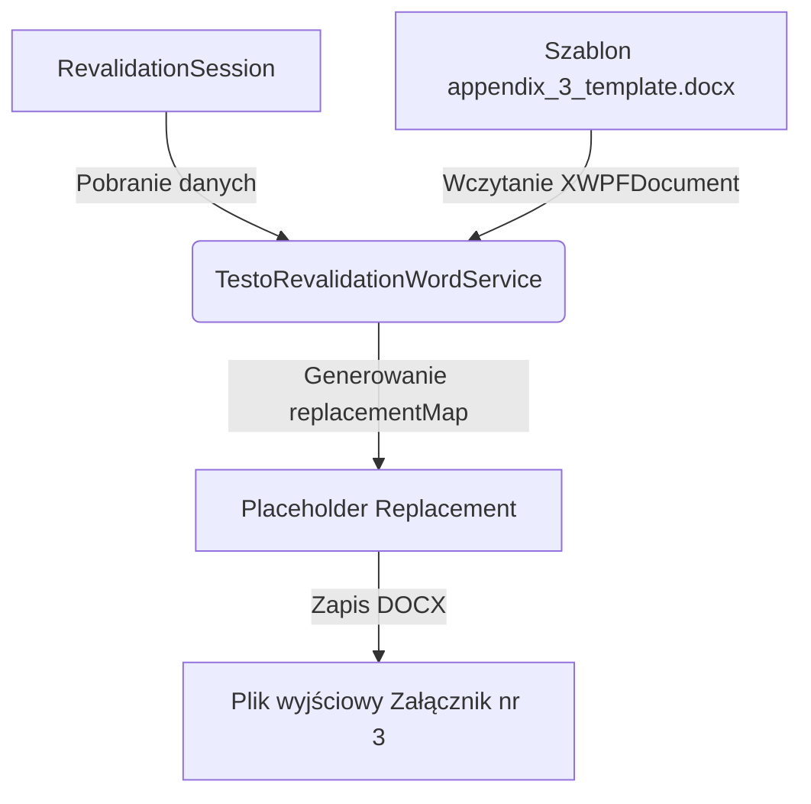

# Technical Specification: Automatyczne Wypełnianie Raportu Walidacji (Załącznik nr 3)

## 1. Architektura i Przepływ Danych
Integracja automatycznego generowania **Załącznika nr 3 (Raport z walidacji procesu przechowywania)** zostanie wbudowana w istniejący serwis [TestoRevalidationWordService.java](file:///c:/Users/macie/Desktop/VCC%20Desktop%20APP/validation-desktop/src/main/java/com/mac/bry/desktop/service/TestoRevalidationWordService.java).



---

## 2. Szablon i Ścieżka Zasobów
Zaktualizowany szablon Worda ze znacznikami zostanie zapisany w zasobach projektu pod ścieżką:
`validation-desktop/src/main/resources/templates/appendix_3_template.docx`

---

## 3. Szczegółowe Mapowanie Znaczników (Replacement Map)

W metodzie `prepareReplacements(session)` zostanie utworzona mapa `Map<String, String>` zawierająca następujące mapowania:

### 3.1. Metadane Ogólne
* `$dzial$` $\rightarrow$ `session.getCoolingDevice().getDepartment().getName()`
* `$pracownia$` $\rightarrow$ `session.getCoolingDevice().getLaboratory() != null ? session.getCoolingDevice().getLaboratory().getName() : "—"`
* `$CelWalidacji$` $\rightarrow$ Wybór na podstawie typu procedury (np. *"Rewalidacja roczna komory"*).
* `$typMaterialu$` $\rightarrow$ `session.getCoolingChamber().getMaterialName()`
* `$data1odczytu$` $\rightarrow$ Najwcześniejszy stempel czasu w seriach pomiarowych (format `yyyy-MM-dd`).
* `$dataOstatniegoOdczytu$` $\rightarrow$ Najpóźniejszy stempel czasu w seriach pomiarowych (format `yyyy-MM-dd`).
* `$nazwaUrzadzenia$` $\rightarrow$ `session.getCoolingDevice().getName()`
* `$typKomory$` $\rightarrow$ `session.getCoolingChamber().getChamberType().getDisplayName()`
* `$numerSeryjnyUrzadzenia$` $\rightarrow$ `session.getCoolingDevice().getInventoryNumber()`
* `$NrRPW$` $\rightarrow$ Numer planu z aktywnego wpisu RPW (Roczne Plany Walidacji) lub domyślnie `"—"`.
* `$skrotPracowni$` $\rightarrow$ Skrót laboratorium / działu z urządzenia chłodniczego lub powiązanego wpisu RPW lub domyślnie `"—"`.
* `$rokRPW$` $\rightarrow$ Rok z aktywnego wpisu RPW lub domyślnie `"—"`.

### 3.2. Kryteria Akceptacji (Sekcja 7)
Weryfikowane na podstawie `chamberType` i `materialType` w komorze:
* `$o1$` (mroźnia) $\rightarrow$ `[X]` lub `""`
* `$o2$` (FFP 3 mies.) $\rightarrow$ `[X]` lub `""`
* `$o3$` (odczynniki/zamrażarka) $\rightarrow$ `[X]` lub `""`
* `$o4$` (KKCz) $\rightarrow$ `[X]` lub `""`
* `$o5$` (KKP) $\rightarrow$ `[X]` lub `""`
* `$o6$` (odczynniki/lodówka) $\rightarrow$ `[X]` lub `""`
* `$o7$` (inne) $\rightarrow$ `[X]` lub `""` (jeśli żadna z powyższych nie pasuje)
* **Obsługa Opcji Nietypowych**:
  * `$InneOpis$` $\rightarrow$ Jeśli `$o7$` to `[X]`, wstaw: `chamber.getChamberType().getDisplayName() + " do: " + chamber.getMaterialName()`, inaczej `""`.
  * `$InneMin$` $\rightarrow$ Jeśli `$o7$` to `[X]`, wstaw: `chamber.getMinOperatingTemp()`, inaczej `""`.
  * `$InneMax$` $\rightarrow$ Jeśli `$o7$` to `[X]`, wstaw: `chamber.getMaxOperatingTemp()`, inaczej `""`.

### 3.3. Tabela Sensorów (Indeks 1 do 8)
Dla każdej pozycji `GridPosition pos` w komorze (gdzie `idx` to numer od 1 do 8):
* `$nrSerRej[idx]$` $\rightarrow$ `positionData.getSerialNumber()`
* `$dataWzorcowaniaRej[idx]$` $\rightarrow$ `positionData.getLatestCalibration().getCalibrationDate()` (sformatowana do `yyyy-MM-dd`)
* `$NrCertRej[idx]$` $\rightarrow$ `positionData.getLatestCalibration().getCertificateNumber()`
* `$lokalizacjaRej[idx]$` $\rightarrow$ `pos.getLabel()`
* `$TminRej[idx]$` $\rightarrow$ `series.getMinTemperature()` (format `%.1f`)
* `$TmaxRej[idx]$` $\rightarrow$ `series.getMaxTemperature()` (format `%.1f`)
* `$TavgRej[idx]$` $\rightarrow$ `series.getAvgTemperature()` (format `%.1f`)

### 3.4. Dane Wyjściowe GxP i Wnioskowanie
* `$AVGTempUrzadzenia$` $\rightarrow$ Średnia arytmetyczna ze średnich temperatur wszystkich aktywnych sensorów (format `%.1f°C`).
* **Weryfikacja alarmów**:
  * Program sprawdza, czy jakakolwiek próbka temperatury przekroczyła zakres `[minOperatingTemp, maxOperatingTemp]`.
  * **Brak przekroczeń**:
    * `$tak$` = `"[X]"`, `$nie$` = `""`.
    * `$Wnioski$` = Opis o prawidłowej pracy i spełnieniu kryteriów akceptacji.
    * `$Uwagi$` = *"Brak uwag. Warunki akceptacji zostały spełnione."*
    * `$dataNastepnejWalidacji$` = Data ostatniego odczytu + 1 rok (format `yyyy-MM-dd`).
  * **Wykryto przekroczenie**:
    * `$tak$` = `""`, `$nie$` = `"[X]"`.
    * `$Wnioski$` = Opis o niespełnieniu kryteriów akceptacji ze względu na przekroczenia temperatur roboczych.
    * `$Uwagi$` = Lista przekroczeń z pozycjami i wartościami (np. *"Przekroczenie w poz: Góra-Tył-Prawy (7.2°C > 6.0°C)"*).
    * `$dataNastepnejWalidacji$` = *"NIEZWŁOCZNIE PO PODJĘTYCH DZIAŁANIACH NAPRAWCZYCH"*.

---

## 4. Zabezpieczenie Split-Run (Apache POI)
W celu zapobieżenia rozbijaniu tagów tekstowych przez wewnętrzny edytor stylów MS Word, metoda `replaceInParagraph` przed podstawieniem wartości z mapy scali wszystkie fragmenty `XWPFRun` w jeden spójny ciąg tekstowy dla danego akapitu.

---

## 5. Integracja z Kompilatorem Paczki ZIP (RevalidationZipCompiler)
Klasa [RevalidationZipCompiler.java](file:///c:/Users/macie/Desktop/VCC%20Desktop%20APP/validation-desktop/src/main/java/com/mac/bry/desktop/service/RevalidationZipCompiler.java) zostanie dostosowana, aby automatycznie dołączać wygenerowany Załącznik nr 3 do paczki rewalidacyjnej ZIP:

1. **Wczytanie szablonu i generowanie**:
   Serwis `TestoRevalidationWordService` otrzyma nową metodę publiczną `generateAppendix3(RevalidationSession session, OutputStream outputStream)` korzystającą z szablonu `/templates/appendix_3_template.docx`.
2. **Generowanie w pliku tymczasowym**:
   W metodzie `compile` zostanie dodana obsługa pliku tymczasowego dla Załącznika nr 3:
   ```java
   File tempDocxFile3 = File.createTempFile("Zalacznik_nr_3_raport_", ".docx");
   try (FileOutputStream fos = new FileOutputStream(tempDocxFile3)) {
       testoRevalidationWordService.generateAppendix3(session, fos);
   }
   ```
3. **Dodanie do ZIP**:
   Plik zostanie dodany do strumienia ZIP pod standardową nazwą wymaganą przez RCKiK:
   ```java
   addFileToZip(zos, tempDocxFile3, "Zalacznik_nr_3_Raport_z_walidacji_procesu_przechowywania.docx");
   ```
4. **Zarządzanie zasobami (Cleanup)**:
   Instancja `tempDocxFile3` zostanie uwzględniona w bloku `finally` metody `compile`, aby zagwarantować jej usunięcie z pamięci tymczasowej systemu operacyjnego po zakończeniu operacji pakowania (zarówno przy sukcesie, jak i błędzie).
