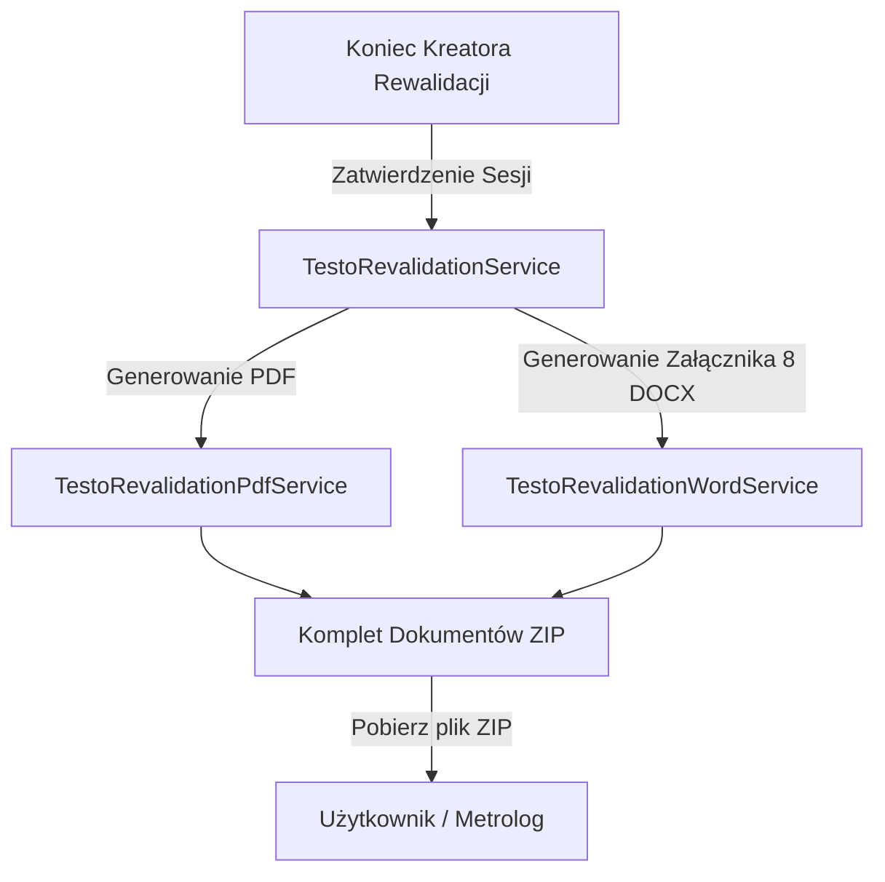

# Analiza Biznesowa (BA) i Specyfikacja Techniczna: Automatyczna Generacja Załącznika nr 8 (Rozmieszczenie Rejestratorów DOCX)

Dokument opisuje cel biznesowy, mapowanie danych oraz architekturę techniczną automatycznego uzupełniania i generowania **Załącznika nr 8 - Graficznego schematu rozmieszczenia rejestratorów temperatury** w formacie `.docx` w procesie okresowej rewalidacji komór chłodniczych GxP.

---

## 1. Cel Biznesowy i Kontekst GxP (RCKiK Compliance)

Regionalne Centra Krwiodawstwa i Krwiolecznictwa (RCKiK) oraz inspektorzy farmaceutyczni (np. GIF) wymagają pełnej, udokumentowanej i nienaruszalnej ścieżki audytowej (Audit Trail) potwierdzającej prawidłowość przeprowadzenia rewalidacji termicznej komór chłodniczych.

**Załącznik nr 8** jest kluczowym dokumentem tej procedury:
*   **Dowód fizycznego rozmieszczenia:** Dokumentuje, w których fizycznych punktach (narożnikach komory, np. Góra-Przód-Lewy) znajdowały się poszczególne rejestratory pomiarowe o określonych numerach seryjnych (S/N).
*   **Identyfikowalność metrologiczna:** Wiąże fizyczne pozycje siatki z wyliczonymi wartościami temperatur skrajnych ($T_{min}$, $T_{max}$) uzyskanymi z odczytów USB, co pozwala audytorowi na natychmiastową ocenę poprawności działania układu chłodniczego oraz jego izolacji.
*   **Wymóg kompletności:** Dokument ten musi znaleźć się w końcowym pakiecie dokumentacji walidacyjnej komory (jako plik `.docx` gotowy do wydruku, podpisu i archiwizacji).

---

## 2. Mapowanie Znaczników (Placeholders Mapping)

System pobiera dane z sesji rewalidacji (`RevalidationSession`), encji urządzeń chłodniczych (`CoolingDevice`), komór (`CoolingChamber`) oraz serii pomiarowych (`ThermoMeasurementSeries`) i wstrzykuje je w miejsce znaczników w pliku Word.

### 2.1. Tabela Mapowania Metadanych

| Znacznik w szablonie | Atrybut w modelu Java / JPA | Przykład wartości |
| :--- | :--- | :--- |
| `$dział$` | `session.getCoolingDevice().getDepartment().getName()` | Dział Walidacji Systemów |
| `%pracownia$` | `session.getCoolingDevice().getLaboratory().getName()` | Pracownia Preparatyki |
| `$nazwaUrzadzenia$` | `session.getCoolingDevice().getName()` | Lodówka Szczepionkowa Liebherr |
| `$numerInw$` | `session.getCoolingDevice().getInventoryNumber()` | DEV-INV-CH100 |
| `$material$` | `session.getCoolingChamber().getMaterialType().getName()` | Krew pełna i osocze |
| `$dataStart$` | `series.getFirstMeasurementTimeLocal()` (Format: `yyyy-MM-dd`) | 2026-05-18 |
| `$dataKoniec$` | `series.getLastMeasurementTimeLocal()` (Format: `yyyy-MM-dd`) | 2026-05-23 |

### 2.2. Tabela Mapowania Rejestratorów i Statystyk (Pozycje 1 - 8)

Dla każdej z 8 pozycji siatki (`RevalidationSession.GridPosition`), system wyciąga powiązane dane z `PositionData`:

| ID pozycji | Znacznik S/N | Znacznik $T_{max}$ | Znacznik $T_{min}$ | Mapowanie w `GridPosition` |
| :---: | :--- | :--- | :--- | :--- |
| **1** | `$nrSerREJ1$` | `$tmax1$` | `$tmin1$` | `TOP_FRONT_LEFT` (Góra - Przód-Lewy) |
| **2** | `$nrSerREJ2$` | `$tmax2$` | `$tmin2$` | `TOP_FRONT_RIGHT` (Góra - Przód-Prawy) |
| **3** | `$nrSerREJ3$` | `$tmax3$` | `$tmin3$` | `TOP_BACK_LEFT` (Góra - Tył-Lewy) |
| **4** | `$nrSerREJ4$` | `$tmax4$` | `$tmin4$` | `TOP_BACK_RIGHT` (Góra - Tył-Prawy) |
| **5** | `$nrSerREJ5$` | `$tmax5$` | `$tmin5$` | `BOTTOM_FRONT_LEFT` (Dół - Przód-Lewy) |
| **6** | `$nrSerREJ6$` | `$tmax6$` | `$tmin6$` | `BOTTOM_FRONT_RIGHT` (Dół - Przód-Prawy) |
| **7** | `$nrSerREJ7$` | `$tmax7$` | `$tmin7$` | `BOTTOM_BACK_LEFT` (Dół - Tył-Lewy) |
| **8** | `$nrSerREJ8$` | `$tmax8$` | `$tmin8$` | `BOTTOM_BACK_RIGHT` (Dół - Tył-Prawy) |

### 2.3. Wizualizacja rozmieszczenia na siatce (Znaczniki `$1$` do `$8$`)

W szablonie dokumentu znajdują się również pojedyncze znaczniki cyfrowe: `$1$`, `$2$`, `$3$`, `$4$`, `$5$`, `$6$`, `$7$`, `$8$`. Służą one do wizualnego oznaczenia pozycji, w których metrolog rozmieścił rejestratory na półkach komory.

Zasada podmiany:
*   Jeżeli w sesji rewalidacji dana pozycja siatki (`GridPosition`) została przypisana i odczytana (czyli `session.getAssignedPositions().containsKey(gridPosition)`):
    *   Znacznik (np. `$1$`) jest podmieniany na literę **`"X"`**.
*   Jeżeli dana pozycja **nie jest wykorzystana** w badaniu (np. mapowanie 5 punktów zamiast 8):
    *   Znacznik jest podmieniany na **spację** (`" "`) lub **pusty tekst** (`""`), aby nie zaciemniać schematu nieaktywnymi pozycjami.

---

## 3. Architektura Techniczna i Biblioteki

### 3.1. Wybór Narzędzia
Rekomendowane jest użycie biblioteki **Apache POI (Moduł POI-OOXML)**. Jest to standardowa, bezpłatna biblioteka Java służąca do odczytu i zapisu formatów Microsoft Office Open XML (w tym `.docx`).

Zależności Maven do dodania w **[pom.xml](file:///c:/Users/macie/Desktop/VCC%20Desktop%20APP/validation-desktop/pom.xml)**:
```xml
<dependency>
    <groupId>org.apache.poi</groupId>
    <artifactId>poi-ooxml</artifactId>
    <version>5.2.5</version>
</dependency>
```

### 3.2. Integracja w Systemie
Szablon pliku `Załącznik nr 8...docx` zostanie umieszczony w zasobach aplikacji (`src/main/resources/templates/appendix_8_template.docx`).
Proces generowania zostanie zintegrowany z istniejącym serwisem walidacji `TestoRevalidationService`.



---

## 4. Algorytm Bezpiecznej Podmiany Tekstu (Split Run Solution)

W plikach `.docx` pojedyncza linijka tekstu lub wyraz (w tym znacznik np. `$nazwaUrzadzenia$`) bywa dzielony w strukturze XML na kilka fragmentów (elementy `<w:r>` - runs), z powodu formatowania lub edycji pliku. 

Aby zapobiec sytuacji, w której parser nie odnajdzie podzielonego znacznika, należy zaimplementować **Algorytm Rekompilacji Akapitów**:

1.  **Odczyt akapitu/komórki tabeli:** Pobierz cały tekst akapitu za pomocą `paragraph.getText()`.
2.  **Sprawdzenie obecności znacznika:** Jeżeli tekst akapitu zawiera symbol `$` (np. `$nazwaUrzadzenia$`), następuje przetwarzanie.
3.  **Rekompilacja biegów (runs):**
    *   Usuń wszystkie istniejące biegi (`XWPFRun`) w akapicie oprócz pierwszego.
    *   W pierwszym biegu ustaw pełny tekst akapitu po dokonaniu operacji `replace(placeholder, value)`.
    *   Zapobiega to rozerwaniu tekstu w strukturze XML.

### Przykładowy kod metody pomocniczej w Java:
```java
public void replacePlaceholderInParagraph(XWPFParagraph paragraph, String placeholder, String replacement) {
    String text = paragraph.getText();
    if (text != null && text.contains(placeholder)) {
        String updatedText = text.replace(placeholder, replacement != null ? replacement : "");
        
        // Usuwanie starych runów i wstawienie jednego, scalonego
        int runSize = paragraph.getRuns().size();
        for (int i = runSize - 1; i > 0; i--) {
            paragraph.removeRun(i);
        }
        if (!paragraph.getRuns().isEmpty()) {
            paragraph.getRuns().get(0).setText(updatedText, 0);
        } else {
            paragraph.createRun().setText(updatedText);
        }
    }
}
```

---

## 5. Przepływ UI / UX i Pobieranie Paczki Walidacyjnej

1.  Użytkownik kończy ostatni krok kreatora mapowania temperatur (krok 4: Generowanie Dokumentacji).
2.  Zamiast jednego przycisku "Generuj PDF", w interfejsie pojawi się opcja **"Generuj Pakiet Dokumentacji Walidacyjnej (ZIP)"** lub dodatkowy przycisk **"Pobierz Załącznik nr 8 (Word)"**.
3.  System generuje dynamicznie:
    *   Główny raport walidacyjny PDF (`raport_rewalidacji_...pdf`).
    *   Uzupełniony o dane i statystyki metrologiczne Word z rozmieszczeniem czujników (`Zalacznik_nr_8_rozmieszczenie_...docx`).
4.  Całość jest pakowana do pliku ZIP za pomocą standardowej klasy `java.util.zip.ZipOutputStream` i oferowana użytkownikowi do zapisu poprzez `FileChooser`.

---

## 6. Plan Weryfikacji (Testy GxP)

*   **Test Poprawności XML:** Upewnienie się, że wygenerowany plik `.docx` otwiera się poprawnie w MS Word, LibreOffice oraz WPS Office bez błędów o uszkodzonej strukturze XML.
*   **Test Wartości Skrajnych:** Sprawdzenie, czy dla komór posiadających mniej niż 8 sensorów (np. małych lodówek, gdzie PDA TR-64 wymaga 5 punktów) nieprzypisane pozycje (np. sensor 6, 7, 8) są automatycznie maskowane lub podmieniane na tekst `"Nie dotyczy"` lub `"-"`.
*   **Test Znaków Diakrytycznych:** Walidacja kodowania UTF-8 przy podmianie polskich znaków (np. "Dział Walidacji Systemów", "Krew pełna", "Urządzenie").
