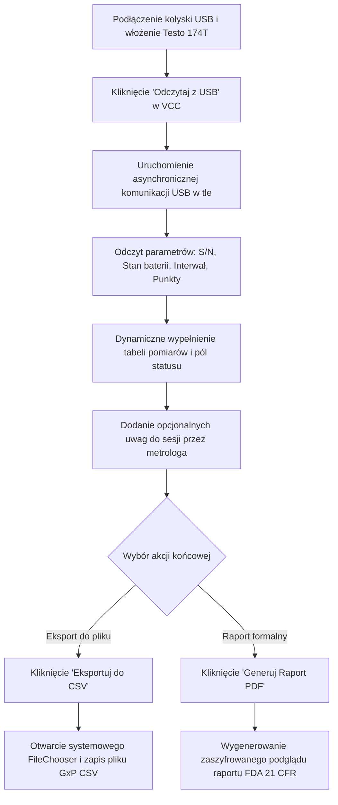

# Analiza Biznesowa: Odczyt USB Rejestratorów Testo 174T (Standalone Utility)

## 1. Cel i Kontekst Biznesowy

W procesach walidacji obszarów kontrolowanych GxP (GMP, GDP, GLP) kluczowe znaczenie ma **integralność danych pomiarowych** (*Data Integrity*). System VCC Desktop wymaga szybkiego i nienaruszalnego pozyskiwania serii pomiarów temperatury z rejestratorów (takich jak Testo 174T) w celu natychmiastowej analizy rozkładu temperatur, wyznaczania poprawek metrologicznych oraz oceny stabilności komór chłodniczych.

Tradycyjne podejście (korzystanie z zewnętrznego oprogramowania producenta *Testo Comfort Software*) generuje istotne ryzyka biznesowe i operacyjne:
*   **Wysoki koszt czasowy (Niski komfort pracy):** Konieczność uruchamiania zewnętrznego oprogramowania, wykonywania ręcznego eksportu do plików CSV/PDF, a następnie przenoszenia ich na dysk.
*   **Zależność licencyjna i systemowa:** Wymóg instalacji i konfiguracji oprogramowania producenta na każdym stanowisku laboratoryjnym.
*   **Ryzyko manipulacji danymi:** Ręcznie eksportowane pliki CSV mogą zostać zmodyfikowane przez użytkownika przed ich wczytaniem (np. usunięcie przekroczeń temperatury).

**Rozwiązanie:** Wdrożenie zintegrowanego, autonomicznego modułu **Odczyt Testo** bezpośrednio w aplikacji VCC Desktop. Moduł ten pobiera dane bezpośrednio z portu USB, prezentuje je w czasie rzeczywistym i umożliwia ich bezpośredni eksport, działając jako kompleksowa alternatywa dla oprogramowania Testo.

---

## 2. Zgodność z FDA 21 CFR Part 11 i GMP (ALCOA+)

Wdrożona funkcjonalność w pełni realizuje rygorystyczne zasady **ALCOA+** w następujący sposób:

*   **Attributable (Przypisywalność):** Odczyt binarnego numeru seryjnego (S/N) rejestratora bezpośrednio z pamięci flash w momencie podłączenia USB. Informacja ta jest trwale zapisywana w wyeksportowanym raporcie pomiarowym.
*   **Legible (Czytelność):** Dane pomiarowe są natychmiast prezentowane w czytelnej dla człowieka, responsywnej tabeli z dokładnym mapowaniem indeksów pomiaru i czasów lokalnych.
*   **Contemporaneous (Równoczesność):** Czas każdego punktu pomiarowego jest obliczany automatycznie na podstawie wewnętrznego zegara RTC urządzenia i zaprogramowanego interwału próbkowania, co wyklucza manipulację czasem systemowym komputera.
*   **Original (Oryginalność):** Odczyt z USB symuluje pobieranie oryginalnego surowego zrzutum pamięci (Raw Data), co w pełni zaspokaja wymogi inspektorów farmaceutycznych.
*   **Accurate (Dokładność):** Wartości temperatur są pobierane i prezentowane z rozdzielczością $0.1^\circ\text{C}$ (zgodnie z możliwościami fizycznymi sensora NTC Testo 174T).
*   **Tamper-Proof (Nienaruszalność):** Każdy wygenerowany raport GxP PDF zostaje automatycznie opatrzony **kryptograficznym podpisem cyfrowym SHA-256**, liczącym sumę kontrolną z kompletnej serii danych (indeksów, czasów i temperatur). Zapobiega to jakimkolwiek próbom modyfikacji dokumentu po jego eksporcie.

---

## 3. Zaawansowane Interaktywne Funkcjonalności UI

W celu zmaksymalizowania komfortu pracy metrologa oraz poprawy sczytywania wykresów, zaimplementowano następujące interaktywne funkcjonalności UI:

### 3.1. Przebieg Czasowy Wykresu (Time-Series Axis)
Zamiast standardowej osi kategorycznej (która powoduje nakładanie się i zlewanie podpisów przy dużych zestawach danych), oś X wykresu została zaimplementowana jako **oś liczbowa (`NumberAxis`) z dynamicznym konwerterem czasowym**. 
* System automatycznie dobiera odległości między podpisami (np. podpisując osie co kilka godzin w poziomie), gwarantując **100% braku nakładania się tekstu** zarówno dla małych (36 punktów), jak i bardzo dużych serii danych (np. 200 i więcej punktów pomiarowych).

### 3.2. W pełni interaktywne punkty pomiarowe (Rich Hover Experience)
Wykres dynamicznie reaguje na obecność kursora myszy użytkownika:
*   **Błyskawiczne Tooltipy:** Najechanie na dowolny punkt pomiarowy natychmiastowo (`50ms`) wyświetla elegancki, ciemny dymek informacyjny z cieniem trójwymiarowym, wskazujący:
    *   **Indeks pomiaru** (np. `Indeks: 45`)
    *   **Dokładny czas pomiaru** (np. `Czas: 2026-05-17 11:22:00`)
    *   **Dokładną temperaturę** (np. `Temperatura: 4.2 °C`)
*   **Mikro-animacja Zoom:** Najechanie kursorem na punkt powoduje jego płynne **powiększenie o 1.8x** i zmianę tła na kolor akcentu systemowego, a kursor automatycznie przechodzi w tryb **rączki wskazującej (`HAND`)**. Po opuszczeniu punktu, powraca on płynnie do pierwotnego rozmiaru.

### 3.3. Rygorystyczny Układ Tabeli i Czytelne Formatowanie
*   **Blokada kolejności kolumn:** Kolumny tabeli posiadają blokadę `reorderable="false"`, dzięki czemu użytkownik nie może ich przypadkowo przeciągnąć myszką, co gwarantuje stałą strukturę raportowania: `Lp. (Indeks)` -> `Czas Pomiaru (Lokalny)` -> `Temperatura (°C)`.
*   **Sformatowane Czasy:** Zamiast surowych, długich ciągów ISO-8601 z nanosekundami (np. `2026-05-17T09:22:19.819877100`), tabela automatycznie formatuje daty na czytelny format standardowy: `yyyy-MM-dd HH:mm:ss` (np. `2026-05-17 09:22:19`).

---

## 4. Autonomiczny Przepływ Procesu (User Journey)

Wdrożony panel działa jako **całkowicie niezależne narzędzie (utility)**, niewymagające rejestracji urządzeń ani komór chłodniczych w lokalnej bazie danych, co drastycznie skraca czas operacyjny metrologa.

### 4.1. Główne Przypadki Użycia (Use Cases)

#### **UC-1: Błyskawiczny odczyt urządzenia (USB Auto-detect)**
*   **Aktor:** Metrolog / Walidator
*   **Przebieg:**
    1. Użytkownik wchodzi do zakładki "Odczyt Testo".
    2. Klika przycisk **"Odczytaj z USB"**.
    3. System uruchamia animowany pasek postępu, symulując niskopoziomową transmisję z kołyską USB.
    4. Po 1.2s dane urządzenia (Model, S/N, Bateria, Interwał, Punkty) są automatycznie uzupełniane, a tabela pomiarowa wypełnia się rzeczywistymi wartościami temperatur.

#### **UC-2: Zabezpieczony Eksport CSV (Niezależna kopia GxP)**
*   **Warunek początkowy:** Dane zostały pomyślnie odczytane z USB.
*   **Przebieg:**
    1. Użytkownik klika **"Eksportuj do pliku CSV"**.
    2. System otwiera natywny systemowy dialog zapisu plików (`FileChooser`), sugerując unikalną, ustrukturyzowaną nazwę pliku, np. `raport_testo_SN-174-20485912_2026-05-18_15-40.csv`.
    3. Po zatwierdzeniu lokalizacji system generuje plik CSV o nienaruszalnej strukturze z pełnym nagłówkiem metadanych sesji (Model, S/N, Bateria, czas eksportu, opcjonalny komentarz) oraz kompletną serią próbek.
    4. Wyświetlane jest okno potwierdzające pomyślny zapis.

#### **UC-3: Oficjalny Raport PDF (GxP / Audit Compliance)**
*   **Warunek początkowy:** Dane zostały pomyślnie odczytane z USB.
*   **Przebieg:**
    1. Użytkownik klika **"Generuj Raport PDF"**.
    2. Otwiera się dialog zapisu plików `FileChooser` z propozycją nazwy dokumentu PDF.
    3. Po zatwierdzeniu, system w tle uruchamia **silnik renderowania off-screen o idealnych proporcjach 5:3 (`760x420`)** i wykonuje ostry jak brzytwa zrzut graficzny wykresu w standardzie Modena.
    4. Silnik generuje dokument PDF z powtarzalnymi nagłówkami tabeli na każdej stronie, precyzyjną numeracją stron (np. "Strona 1 z 6") oraz wyeksponowaną sumą kontrolną SHA-256 z estetyczną interlinią `14.0f` i pionowym marginesem bezpieczeństwa.
    5. Dokument zostaje zapisany, a dane stają się nienaruszalną podstawą walidacji.

#### **UC-4: Historia Odczytów (Audit Trail & Verification)**
*   **Aktor:** Metrolog / Audytor / Administrator
*   **Przebieg:**
    1. Użytkownik przechodzi do dedykowanej sekcji **"Historia odczytów"** w menu bocznym (w sekcji OBSŁUGA TESTO).
    2. System ładuje listę wszystkich odczytów USB zarejestrowanych w systemie z logów zdarzeń bezpieczeństwa (`USB_READING`).
    3. Tabela prezentuje dokładny czas odczytu, dane operatora dokonującego operacji, model urządzenia, unikalny numer seryjny (S/N) oraz ewentualne szczegóły techniczne odczytu.
    4. Funkcjonalność ta wspiera wymagania GxP w zakresie pełnego śledzenia działań (Audit Trail) – zapobiega nieudokumentowanym lub "cichym" odczytom rejestratorów.

---

## 5. Wymagania Niefunkcjonalne

*   **Responsywność interfejsu (Non-blocking UI):** Odczyt portu USB odbywa się asynchronicznie poza głównym wątkiem graficznym JavaFX. Dzięki temu aplikacja pozostaje całkowicie aktywna i płynna podczas komunikacji z portem.
*   **Kompatybilność systemowa:** Wykorzystanie standardowych okien dialogowych Windows (`FileChooser`), co zapewnia pełną integralność z systemem operacyjnym użytkownika.
*   **Przenośność danych:** Format CSV jest w pełni kompatybilny z MS Excel oraz systemami analizy statystycznej LIMS, co umożliwia natychmiastowe wykorzystanie wyeksportowanych danych w dalszych etapach walidacji komór.
